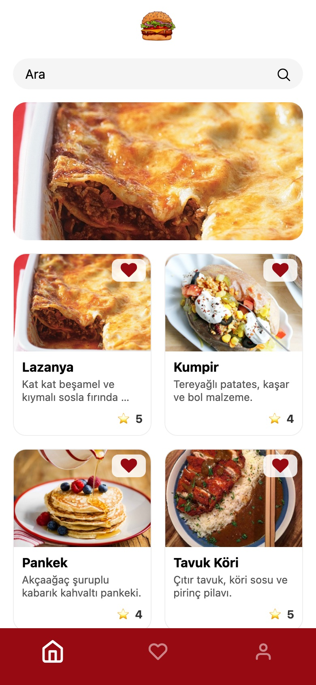
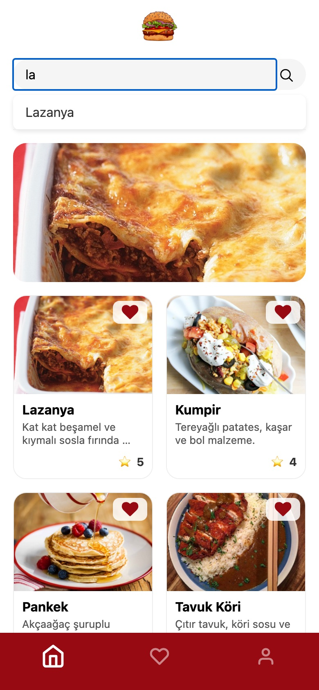
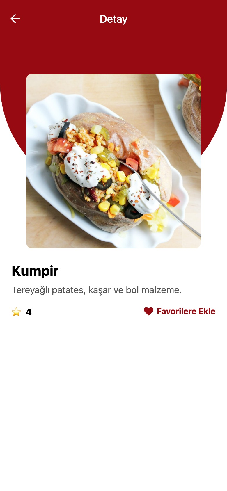
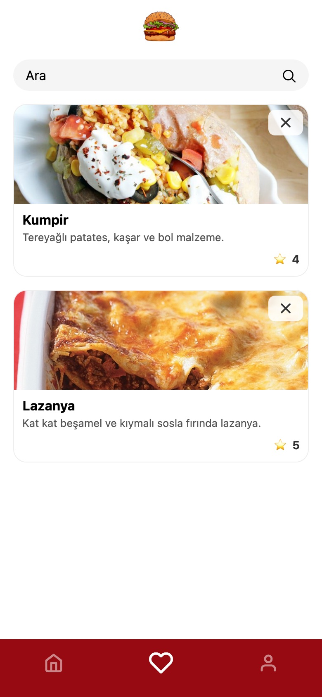
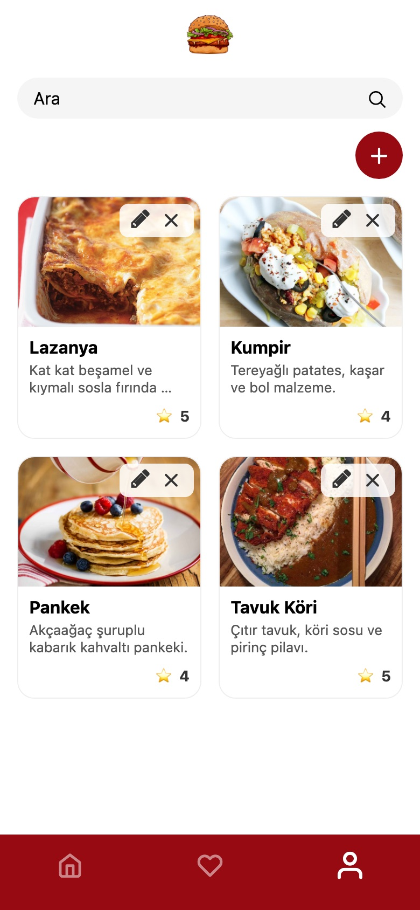
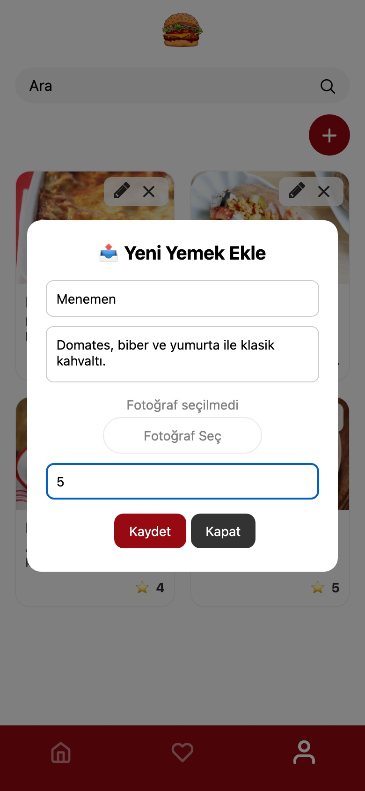

# 🍔 Food Book — Bugün Ne Pişirsem?

Tariflerini fotoğraflarıyla kaydedip puanlayabildiğin, favorilerini ayırabildiğin bir **React Native (Expo)** uygulaması. Veriler **Firebase Firestore**'da, favoriler cihazda (**AsyncStorage**) tutulur. iOS, Android ve Web'de çalışır.

## Ekran Görüntüleri

| Ana Sayfa | Arama | Detay |
| :---: | :---: | :---: |
|  |  |  |

| Favoriler | Tariflerim | Yeni Tarif |
| :---: | :---: | :---: |
|  |  |  |

## Özellikler

- **Ana sayfa:** Öne çıkan tarifler için kaydırmalı slider ve iki sütunlu tarif kartları
- **Anlık arama:** Başlığa göre filtreleme, sonuçtan doğrudan detay sayfasına geçiş
- **Detay sayfası:** Fotoğraf, açıklama, puan ve tek dokunuşla favorilere ekleme
- **Favoriler:** Cihazda saklanan favori listesi, ekleme/çıkarma
- **Tariflerim:** Tarif ekleme, düzenleme ve (onaylı) silme — Firestore CRUD
- **Fotoğraf yükleme:** Galeriden seçim, kırpma ve sıkıştırma (Firestore'a base64 olarak kaydedilir)
- Toast bildirimleri, boş/hata durumları, sekmeye her dönüşte otomatik yenileme

## Teknolojiler

| Alan | Kullanılan |
| --- | --- |
| Framework | Expo SDK 54, React Native 0.81, React 19 |
| Navigasyon | React Navigation 7 (Bottom Tabs + Native Stack) |
| Veri | Firebase Firestore |
| Yerel depolama | @react-native-async-storage/async-storage |
| Diğer | expo-image-picker, react-native-toast-message, @expo/vector-icons |

## Proje Yapısı

```
food-book/
├── App.js                     # Uygulama girişi (navigator + toast)
├── assets/                    # İkonlar ve logo
├── docs/screenshots/          # README görselleri
└── src/
    ├── components/            # Card, SearchBar, Slider, PostFormModal, ScreenContainer, EmptyState
    ├── config/firebase.js     # Firebase başlatma (env değişkenleri)
    ├── hooks/usePosts.js      # Tarif listesini ekran odaklandıkça yenileyen hook
    ├── navigation/            # Tab + stack navigasyon
    ├── screens/               # Home, Detail, Favorites, User
    ├── services/              # posts (Firestore CRUD), favorites (AsyncStorage)
    └── theme/colors.js        # Renk paleti
```

## Kurulum

**Gereksinimler:** Node.js 20+, npm, telefonda [Expo Go](https://expo.dev/go) veya bir emülatör.

```bash
git clone https://github.com/zeynepbass/food-book.git
cd food-book
npm install
cp .env.example .env   # Firebase bilgilerini doldur
npm start
```

Ardından terminaldeki QR kodu Expo Go ile okut ya da `a` (Android), `i` (iOS), `w` (Web) tuşlarına bas.

### Ortam Değişkenleri

Firebase Console → Project settings → *Your apps* → Web app bölümündeki değerleri `.env` dosyasına gir:

```env
EXPO_PUBLIC_FIREBASE_API_KEY=
EXPO_PUBLIC_FIREBASE_AUTH_DOMAIN=
EXPO_PUBLIC_FIREBASE_PROJECT_ID=
EXPO_PUBLIC_FIREBASE_STORAGE_BUCKET=
EXPO_PUBLIC_FIREBASE_MESSAGING_SENDER_ID=
EXPO_PUBLIC_FIREBASE_APP_ID=
EXPO_PUBLIC_FIREBASE_MEASUREMENT_ID=
```

> `.env` git'e dahil edilmez. Firestore'da `posts` koleksiyonu kullanılır; güvenlik kurallarının okuma/yazmaya izin verdiğinden emin ol.

## Komutlar

| Komut | Açıklama |
| --- | --- |
| `npm start` | Expo geliştirme sunucusunu başlatır |
| `npm run android` | Android'de açar |
| `npm run ios` | iOS simülatöründe açar |
| `npm run web` | Tarayıcıda açar |
| `npx expo-doctor` | Bağımlılık ve yapılandırma kontrolü |
